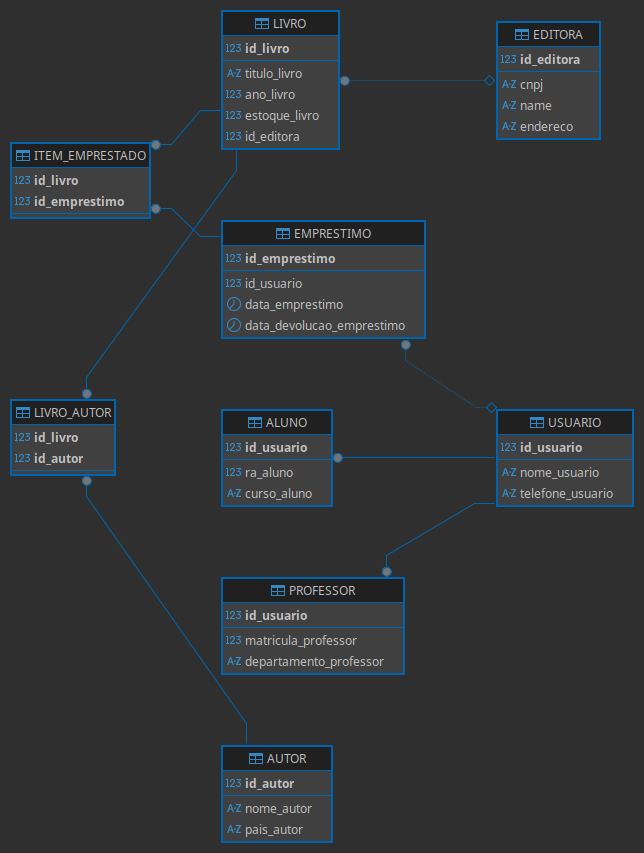

📚 SQL Server: Modelagem Relacional & Sistema de Biblioteca
Este repositório documenta meus estudos em Sistemas de Informação (PUC Minas), focando em Engenharia de Software aplicada a Bancos de Dados Relacionais. Aqui você encontrará tanto a infraestrutura de desenvolvimento quanto a implementação prática de um sistema de biblioteca.

🛠️ Stack Técnica & Ambiente
Engine: Microsoft SQL Server (T-SQL)

Ambiente: Docker (Infraestrutura como código para persistência e isolamento)

Client: DBeaver 26.0.2 (Interface para gerenciamento e modelagem ER)

📖 O Projeto: Gerenciamento de Biblioteca
O objetivo deste exercício foi modelar e implementar o ecossistema de uma biblioteca acadêmica, tratando regras de negócio complexas como empréstimos, categorias de usuários (Alunos/Professores) e vínculos de autores.

🧠 Destaques de Engenharia & Lógica
Modelagem Relacional (DER): Implementação de relacionamentos 1:N e N:N (tabelas associativas).

Normalização & Integridade: Uso rigoroso de PRIMARY KEY e FOREIGN KEY para evitar dados órfãos.

Generalização/Especialização: Estruturação de entidades de usuários para evitar redundância de dados.

Consultas Avançadas: Construção de "Relatórios Master" utilizando múltiplos INNER JOINs e filtros de regras de negócio.

Padronização: Tratamento de dados sensíveis e formatos de data (ISO 8601).

📂 Estrutura do Repositório
/src: Scripts de criação de tabelas (DDL) e população inicial (DML).

/queries: Consultas complexas e relatórios de lógica de negócio.

/docs: Documentação técnica e Diagrama Entidade-Relacionamento (DER).

/img: Assets visuais para o README.

📊 Visualização do Banco de Dados

